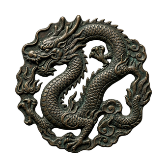

# Cara o Cruz

<p align="center">
  
</p>

Juego de **Cara o Cruz** (heads or tails) desarrollado en **JavaFX**. El jugador introduce su nombre, elige CARA o CRUZ, y la moneda se lanza animadamente con un efecto de giro 3D. El objetivo es conseguir la racha más larga posible. Las puntuaciones se guardan de forma persistente en SQLite y se muestra un ranking de las 5 mejores rachas.

---

## Características

- **Animación 3D de la moneda** — Efecto de compresión (`ScaleTransition`) con parpadeo sincronizado de las caras para simular el giro
- **Interfaz gráfica completa (JavaFX)** — Pantalla completa, botones con estilos, sombras dinámicas que cambian de color según acierto o fallo
- **Entrada por consola** — El nombre del jugador se solicita al arrancar mediante `Scanner`
- **Salida formateada** — Uso de `printf` y `String.format` para mostrar resultados y ranking con formato tabulado
- **Arquitectura basada en interfaces** — `RankingDAO` define el contrato de persistencia con implementación en SQLite mediante JDBC
- **Base de datos SQLite (SGBDR)** — Persistencia mediante JDBC con tabla `ranking` (id, nombre, racha). La tabla se crea automáticamente al iniciar
- **Clasificador de SGBD** — Al arrancar la aplicación, `ClasificadorSGBD` imprime por consola un análisis de SQLite como sistema de persistencia
- **Ranking persistente** — Top 5 de mejores rachas visible en un `ListView` y también por consola
- **Contador de racha** — Label sobre la moneda que muestra la racha actual en tiempo real
- **Música de fondo** — Reproducción continua de un archivo WAV con `MediaPlayer`

---

## Tecnologías

| Tecnología | Versión |
|------------|---------|
| Java | 21 |
| JavaFX | 21 |
| SQLite (JDBC) | 3.45.3 |
| Maven | 3.x |
| JUnit | 5.11 |

---

## Estructura del proyecto

```
src/main/java/
├── app/Main.java                        ← Punto de entrada (Application)
├── controller/
│   ├── JuegoController.java             ← Lógica del juego, animaciones, eventos
│   └── MusicManager.java               ← Reproductor de música de fondo
├── dao/
│   ├── RankingDAO.java                 ← Interfaz de persistencia
│   └── RankingSQLiteDAO.java           ← Implementación con SQLite (SGBDR)
├── database/
│   └── ConexionDB.java                 ← Conexión JDBC a SQLite
├── model/
│   └── Partida.java                    ← Modelo de datos
└── service/
    ├── ClasificadorSGBD.java           ← Clasificación de sistemas de persistencia
    └── RankingService.java             ← Capa de negocio

src/main/resources/
├── css/estilo.css                      ← Estilos de los botones
├── img/
│   ├── cara.png                        ← Imagen CARA
│   └── cruz.png                        ← Imagen CRUZ
└── sound/
    └── musica_fondo.wav                ← Música de fondo
```

---

## Cómo ejecutar

```bash
mvn javafx:run
```

Al arrancar se pedirá el nombre del jugador por consola. Después se abre la ventana del juego en pantalla completa.

---

## Cómo jugar

1. Introduce tu nombre al iniciar
2. Pulsa **CARA** o **CRUZ** para lanzar la moneda
3. La moneda gira y muestra el resultado
4. Si aciertas, la racha aumenta; si fallas, se reinicia
5. Pulsa **VER RANKING** para ver las mejores rachas guardadas
6. Tu mejor racha se guarda automáticamente al fallar si supera tu récord anterior
